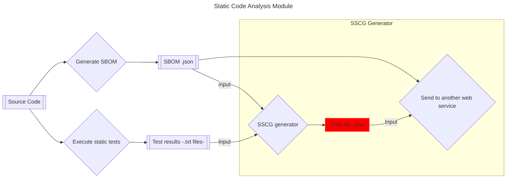

# Static Software Supply Chain Guarantee (SSCG) Generator

**Table of content** 📚

- [Static Software Supply Chain Guarantee (SSCG) Generator](#static-software-supply-chain-guarantee-sscg-generator)
  - [Context](#context)
  - [Requeriments](#requeriments)
  - [Build and run 🛠️](#build-and-run-️)
    - [Build](#build)
    - [Run](#run)

## Context

In the context of **RESCALE**, [Stritzinger](https://www.stritzinger.com) is overseeing the development of component known as the **Static Code Analysis Module**.
This module analyzes the source code and produces two output files:

1. **Test Report**: A file containing the results of various static tests performed on the source code (in `.txt` format).
2. **SBOM (Software Bill of Materials)**: A structured document (in CycloneDX `.json` format) that lists all project dependencies.

The test report and the SBOM are combined as inputs to produce the SSCG (Static Software Supply Chain Guarantee).



The SSCG (Static Software Supply Chain Guarantee) is a CycloneDX document that combines the metadata from the SBOM with additional information about the testing process, ensuring the integrity and security of the software supply chain. It provides a detailed overview of the project’s components, test results, and other critical metadata, such as the tools used in the analysis.

Once the SSCG is generated, it is submitted—along with the SBOM (that includes more information about the project and its dependencies)—to a web service for further processing. This is done by sending both files to an HTTP endpoint, where the SSCG undergoes additional validation or integration into a broader system. The process ensures that the project’s dependencies and test outcomes are well-documented and traceable, providing greater transparency and confidence in the software’s supply chain.

For reference, you can find more information about SSCG [here](/docs/sscg.md) and, a SSCG example [here](/priv/result/sscg-example.json).

## Requeriments

For RESCALE, the following are required:

- `Erlang`: Version `27.0`
- `Rebar`: Version `3.24.0`

⚠️ Note: Due to dependencies (specifically argparse), the minimum supported OTP version is 26.

## Build and run 🛠️

### Build

Run this command to generate an escript executable containing the project’s and
its dependencies’ BEAM files.

```sh
rebar3 escriptize
```

### Run

To run sscg command-line app, execute the following command:

```sh
_build/default/bin/sscg_generator
```

💡 **Tip**

For convenience, you can create a symlink to easily execute `sscg_generator`
 from any location in your `PATH`, following these steps:

1. Ensure that `~/.local/bin` is included in your `PATH`. You can add it to your
 shell configuration file (e.g., `.bashrc`, `.bash_profile`, or `.zshrc`), if
 it’s not already present:

    ```sh
    echo 'export PATH="$HOME/.local/bin:$PATH"' >> ~/.zshrc
    ```

2. Navigate to the `~/.local/bin` directory and create a symbolic link to the `sscg_generator` executable:

    ```sh
    cd ~/.local/bin
    ln -s /path/to/sscg_generator/_build/default/bin/sscg_generator
    ```

    ⚠️ Replace `/path/to/sscg_generator` with the actual path to your sscg_generator project directory.

Then, you can run `sscg_generator` from anywhere in your terminal.
