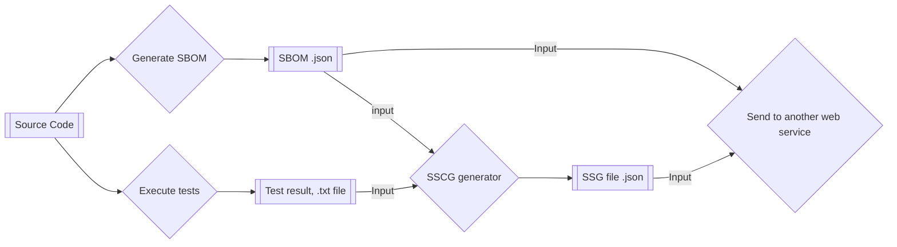

# Static Software Supply Chain Guarantee (SSCG) Generator

**Table of content**

- [Static Software Supply Chain Guarantee (SSCG) Generator](#static-software-supply-chain-guarantee-sscg-generator)
  - [Description](#description)
  - [Requeriments](#requeriments)
  - [Build](#build)
  - [Run](#run)

## Description



In the context of **RESCALE**, Stritzinger is overseeing the development of the **Static Code Analysis Module**. This module runs various tests on source code
and generates test reports.

The outputs, which include the `test reports` (`.txt` format) and the `SBOM` (`.json` format), are then used as inputs to generate a `CycloneDX document` containing metadata and other relevant information. This document is known as the `SSCG` (Static Software Supply Chain Guarantee).

Once the SSCG is generated, it is sent, along with the SBOM, to another web service for further processing, where the SSCG is submitted to an HTTP endpoint.

For reference, you can find an SSCG example here: [SSCG Example](./priv/result/sscg-example.json), and more information about SBOM here: [SBOM](/docs/sbom.md).

## Requeriments

- Erlang 27.0
- Rebar 3.24.0

## Build

Run this command to generate an escript executable containing the project’s and
its dependencies’ BEAM files.

```sh
rebar3 escriptize
```

## Run

To run sscg command-line app, execute the following command:

```sh
_build/default/bin/sscg_generator
```

💡 **Tip**

For convenience, you can create a symlink to easily execute `sscg_generator`
 from any location in your `PATH`, following these steps:

1. Ensure that `~/.local/bin` is included in your `PATH`. You can add it to your
 shell configuration file (e.g., `.bashrc`, `.bash_profile`, or `.zshrc`), if
 it’s not already present:

    ```sh
    echo 'export PATH="$HOME/.local/bin:$PATH"' >> ~/.zshrc
    ```

2. Navigate to the `~/.local/bin` directory and create a symbolic link to the `sscg_generator` executable:

    ```sh
    cd ~/.local/bin
    ln -s /path/to/sscg_generator/_build/default/bin/sscg_generator
    ```

    ⚠️ Replace `/path/to/sscg_generator` with the actual path to your sscg_generator project directory.

Then, you can run `sscg_generator` from anywhere in your terminal.
