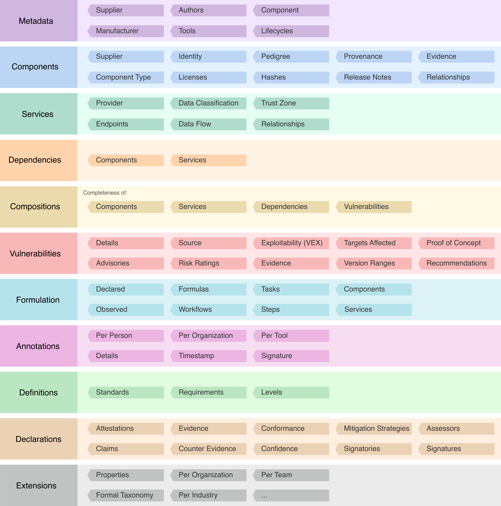

# OWASP CycloneDX Software Bill of Materials (SBOM) Standard

OWASP CycloneDX is a full-stack Bill of Materials (BOM) standard that provides
 advanced supply chain capabilities for cyber risk reduction.

## Definitions

- **Software Bill of Materials (SBOM)** Inventory software components and services
 and the dependency relationships between them.

## Description

CycloneDX can represent any type of software component along with services the software relies on. Refer to [Use Cases](https://cyclonedx.org/use-cases) for details on the many possibilities that exist for beginner, intermediate, and advanced SBOM use cases.

## Examples

BOMs demonstrating SBOM capabilities can be found at [https://github.com/CycloneDX/bom-examples](./https://github.com/CycloneDX/bom-examples).
