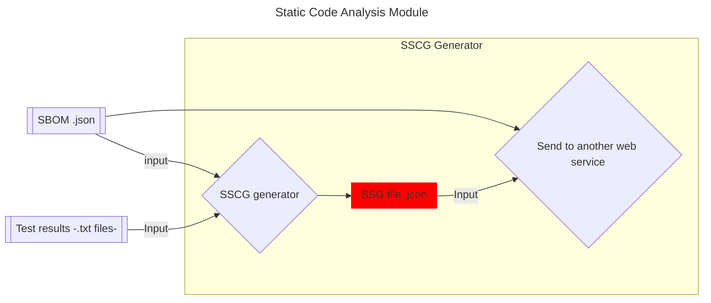

# Static Software Supply Chain Guarantee (SSCG)

**Table of content** 📚

- [Static Software Supply Chain Guarantee (SSCG)](#static-software-supply-chain-guarantee-sscg)
  - [Description](#description)
    - [Static Code Analysis Module Process Overview](#static-code-analysis-module-process-overview)
  - [SSCG Structure](#sscg-structure)
    - [Key Fields](#key-fields)
  - [Python Validator for SSCG](#python-validator-for-sscg)

## Description

The SSCG generator is a component of a static code analysis module that
consolidates two key pieces of information —test results and a Software Bill
of Materials (SBOM)— into a structured document called the `SSCG`. This document
serves to attest to the integrity and security of the source code.

### Static Code Analysis Module Process Overview

1. Source Code is analyzed to produce an SBOM (a document that lists the project’s dependencies).
2. Static Tests are executed on the Source Code, generating Test Results (e.g., a .txt file).
3. Both the SBOM and the Test Results are input into the SSCG Generator, which creates an SSCG file in `.json` format.

❗ **Disclaimer**: While we refer to the SBOM as the document associated with the
software being analyzed, the SSCG itself is also an SBOM. It adheres to the
SBOM standard and includes additional metadata related to the testing process
and analysis.

## SSCG Structure

The SSCG file is a JSON document that includes various fields that detail the
source code, test results, and relevant metadata. Below is an example of its
structure: [sscg/0](sscg_generator_generate.html#t:sscg/0).

### Key Fields

| **Field**                             | **Description**                                                                                                                |
|---------------------------------------|--------------------------------------------------------------------------------------------------------------------------------|
| `bomFormat`                           | Specifies the format that the SBOM (Software Bill of Materials) adheres to.                                                    |
| `specVersion`                         | ndicates the specific version of the SBOM format being used.                                                                   |
| `serialNumber`                        | A unique identifier for the BOM document.                                                                                      |
| `metadata`                            | Metadata about the BOM, including information about the tools used to generate it.                                             |
| `metadata.tools.components`           | Describes the tools used in the static analysis module (e.g., SSCG generator app).                                             |
| `metadata.tools.components.XY.data`   | Contains specific data related to the tools, such as configuration flags, versions, and details of how they were used.         |
| `definitions.standards`               | Information about the standard used for generating the SSCG (such as ReSCALE or another standard).                             |
| `declarations.targets.components`     | The target components (software or libraries) that were analyzed, as specified in the SBOM.                                    |
| `attestations`                        | Statements verifying the testing or analysis process, typically providing guarantees about the results.                        |
| `claims`                              | Claims made about the integrity, security, or performance of the target components.                                            |
| `claims.evidence`                     | A pointer to the evidence supporting the claims.                                                                               |
| `evidence`                            | The actual test output or evidence, including details like file contents, test results, or configuration settings.             |

Other info...

| **Field**                             | **Description**                                                                                                                |
|---------------------------------------|--------------------------------------------------------------------------------------------------------------------------------|
| `bom-ref`                             | References pointing to elements within the BOM (used to connect claims, evidence, or components).                              |

## Python Validator for SSCG

A Python script called `cdx-rescale-validator` can be used to validate the SSCG file and ensure it follows the correct format. You can use the `os:cmd` function to run the validator from within an Erlang system. This will check whether the input SBOM is properly formatted and adheres to the required standards.
