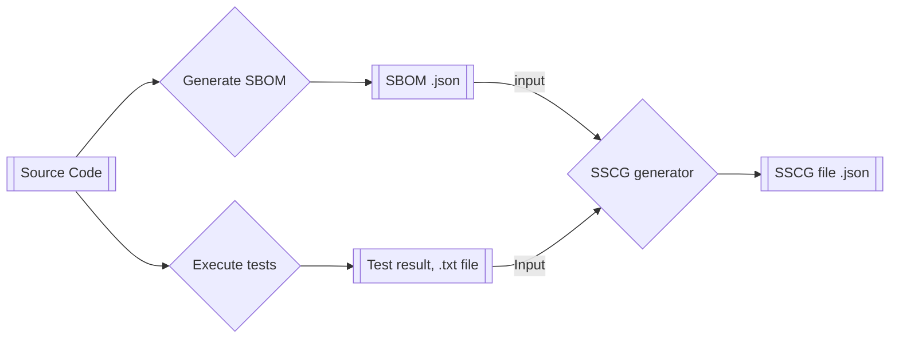

# Static Software Supply Chain Guarantee (SSCG)

## Definition

The **Static Software Supply Chain Guarantee (SSCG)** is a **Software Bill of Materials (SBOM)** generated by processing:

1. **Test Results**: A collection of results from executing static tests on the source code, outputting test result files.
2. **SBOM**: A CycloneDX `.json` document that contains a list of dependencies used in the source code.

The SSCG combines these two pieces of information into a structured document that can be used to attest to the integrity and security of the source code.



The diagram outlines the process:

- **Source Code** is analyzed to generate an **SBOM**.
- **Static Tests** are executed on the same **Source Code**, generating **Test Results** (e.g., `.txt` file).
- Both the **SBOM** and **Test Results** are input into the **SSCG Generator**, which produces an **SSCG file (.json)**.

## SSCG Structure

The SSCG file is a JSON document that includes various fields that detail the
 source code, test results, and relevant metadata. Below is an example of
  its structure:

```json
{
    "bomFormat": "...",
    "specVersion": "...",
    "serialNumber": "...",
    "metadata": {
        "...",
        "tools": {
            "components": [
                {"name": "XY tool", 
                 "...",
                 "data": [{"..."}] // E.g: configuration flags
                 }
            ]
        }
    },
    "definitions": "...", // Info about the current ReSCALE tool 
    "declarations": {
        "targets": {
            "components": "..." // Components of the source code, specified in the SBOM
        }
    },
    "attestations": [{
        "...",
        "map": [
            {"...",
             "counterClaims": "claim-ref" // Reference to the claim associated with the related test results
            }
        ]
    }],
    "claims": [{
        "bom-ref": "...", // Claim ID 
        "target": "...",
        "evidence": ["..."] // Reference to the evidence associated with the related test results
    }],
    "evidence": [{
        "bom-ref": "...",
        "...",
        "data": {
            "contents": {
                "attachment": {
                    "content": "..." // Content of the test result evidence output, e.g., syntax error at line 32
                }
            } 
        }
    }]
}
```

### Key Fields

| **Field**                             | **Description**                                                                                                                |
|---------------------------------------|--------------------------------------------------------------------------------------------------------------------------------|
| `bomFormat`                           | The format of the SBOM (Bill of Materials).                                                                                    |
| `specVersion`                         | The version of the BOM specification.                                                                                          |
| `serialNumber`                        | A unique identifier for the BOM document.                                                                                      |
| `metadata`                            | Metadata about the BOM, including information about the tools used to generate it.                                             |
| `metadata.tools.components`           | Describes the tools used in the analysis (e.g.,SSCG generator application, the container used to obtain the test results, etc. |
| `metadata.tools.components.XY.data`   | Contains specific data related to the tools, such as configuration flags, versions, and details of how they were used.         |
| `definitions.standards`               | Information about the standard used for generating the SSCG (such as ReSCALE or another standard).                             |
| `declarations.targets.components`     | The target components (software or libraries) that were analyzed, as specified in the SBOM.                                    |
| `attestations`                        | Statements verifying the testing or analysis process, typically providing guarantees about the results.                        |
| `attestations.<>.map.counterClaims`   | Pointers to the claims                                                                                                         |
| `claims`                              | Claims made about the integrity, security, or performance of the target components.                                            |
| `claims.evidence`                     | A pointer to the evidence (e.g., test results or output) supporting the claims.                                                |
| `evidence`                            | The actual test output or evidence, including details like file contents, test results, or configuration settings.             |

Other info...

| **Field**                             | **Description**                                                                                                                |
|---------------------------------------|--------------------------------------------------------------------------------------------------------------------------------|
| `bom-ref`                             | References pointing to elements within the BOM (used to connect claims, evidence, or components).                              |

## Python Validator for SSCG

A Python script called `cdx-rescale-validator` can be used to validate the SSCG file and ensure it follows the correct format. You can use the `os:cmd` function to run the validator from within an Erlang system. This will check whether the input SBOM is properly formatted and adheres to the required standards.
